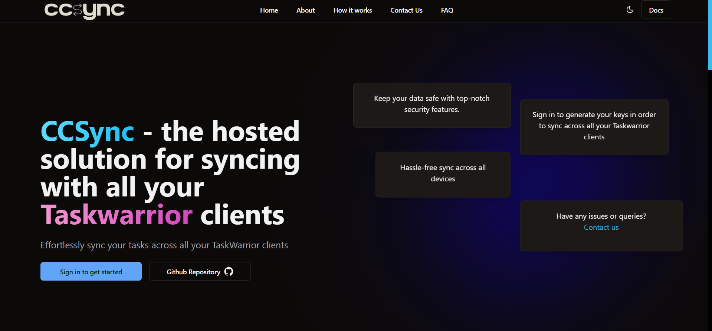
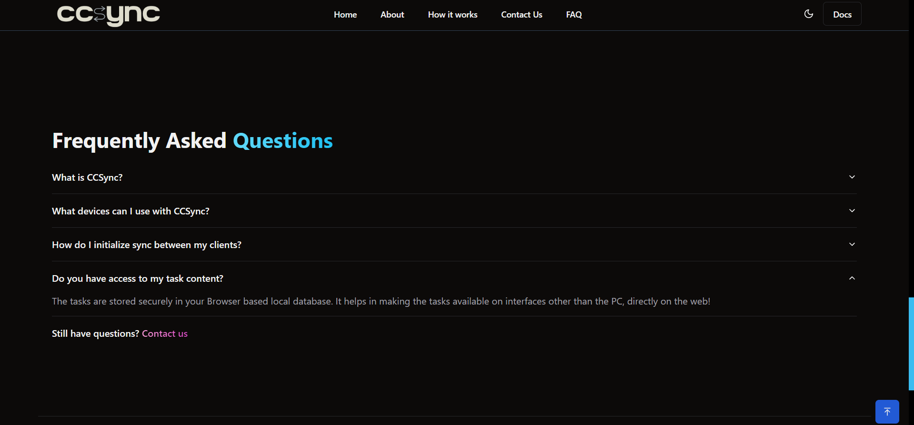
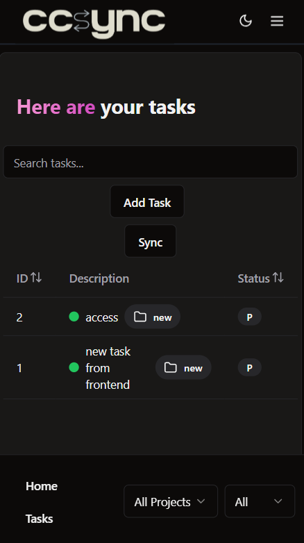
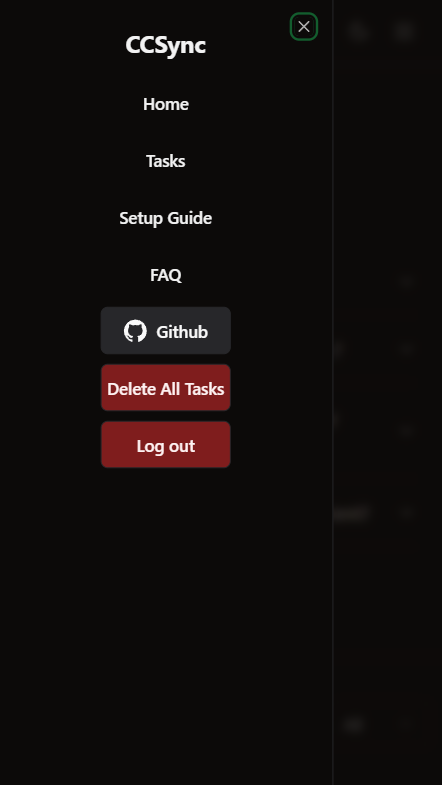

  
  <h3>Web Interface + Sync Server for Taskwarrior 3.0 and Higher</h3>

  

    A self-hosted solution for syncing and managing your tasks anywhere, anytime.
  

  

    
    
    
    
    
  

  

    
    
  

  

    <a href="https://its-me-abhishek.github.io/ccsync-docs/">📘 Documentation</a> •
    <a href="https://abhishek31.medium.com/">📝 Blogs</a> •
    <a href="https://github.com/its-me-abhishek/gsoc-report">📄 GSoC Report</a> •
    <a href="https://www.youtube.com/watch?v=8UhAeM8iWzQ">🎥 Setup Video</a>
  

## Table of Contents

- [Overview](#overview)
- [Screenshots](#screenshots)
- [Features](#features)
- [Architecture](#architecture)
- [Contributing](#contributing)
- [License](#license)

## Overview

**CCSync** is a web UI and API that synchronizes your [Taskwarrior](https://taskwarrior.org/) tasks across all your clients using a [`taskchampion-sync-server`](https://github.com/GothenburgBitFactory/taskchampion-sync-server).

Whether you prefer the **CLI**, **Web Frontend**, or **Flutter Mobile App**, CCSync keeps everything in sync efficiently and securely.

## Screenshots

  <table align="center">
    <tr>
      <td></td>
      <td></td>
    </tr>
    <tr>
      <td></td>
      <td></td>
    </tr>
  </table>

## Features

- **Task Management** — Create, read, update, and delete tasks seamlessly.
- **Cross-Platform Sync** — Keep all Taskwarrior 3.0+ clients in sync automatically.
- **RESTful API** — Manage and query tasks programmatically.
- **Web Frontend** — Clean and responsive UI for easy task handling.
- **Mobile Integration** — Compatible with the [Taskwarrior Flutter App](https://github.com/CCExtractor/taskwarrior-flutter).
- **Backend Commands** — Full control via Taskwarrior-compatible commands.

## Architecture

CCSync is composed of **three core modules**:

1. **Backend** — The REST API and logic layer that communicates with Taskwarrior clients.
2. **Web Frontend** — A modern web UI that stores and manages tasks in-browser.
3. **Taskchampion Sync Server** — In order to sync tasks with you Taskwarrior instances, CCSync by default uses the offical Taskchampion sync server image to sync tasks.

📖 Learn more in the [official documentation](https://its-me-abhishek.github.io/ccsync-docs/).

## Testing with Postman

1. Open **Postman**.
2. Click **Import** → Select `ccsync.postman_collection.json`.
3. Modify the body fields and start testing!

## Contributing

We welcome all type of contributions!  
Check out the [Contributing Guidelines](CONTRIBUTING.md) and raise issues or PRs.

  

## Community

Join discussions and get support on **Zulip** 👇  

## License

Licensed under the **MIT License** — see the [LICENSE](LICENSE) file for details.

🔝 [Back to Top](#table-of-contents)

